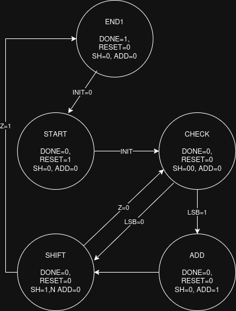
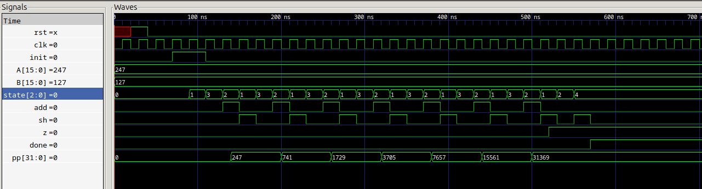
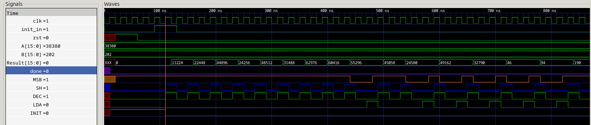
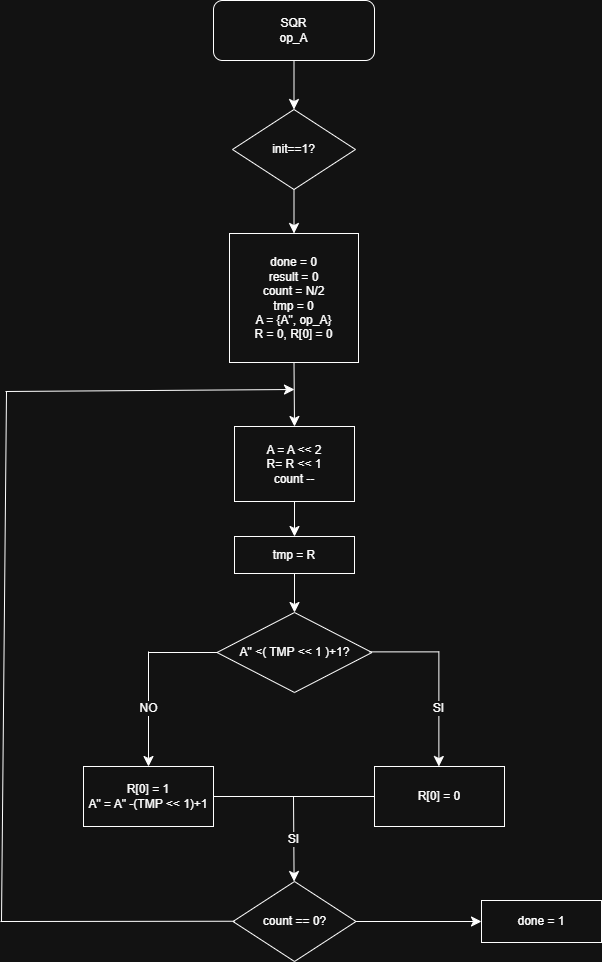
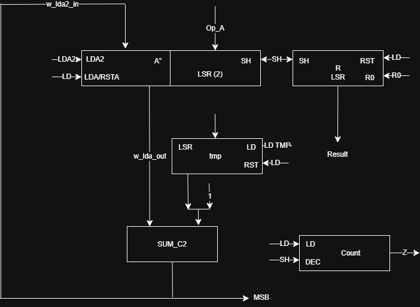
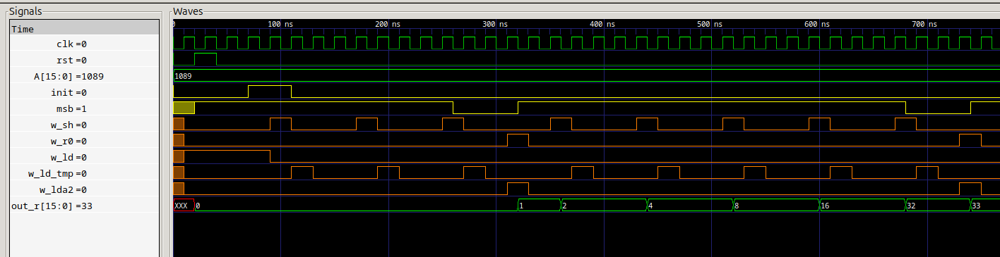
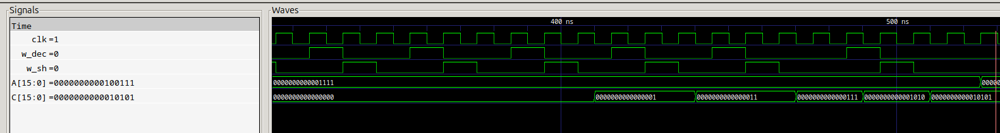
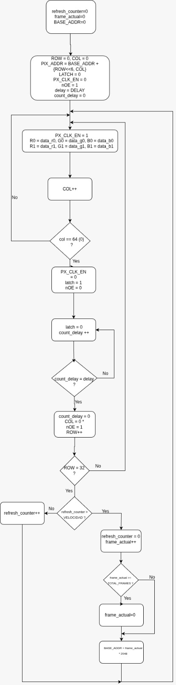
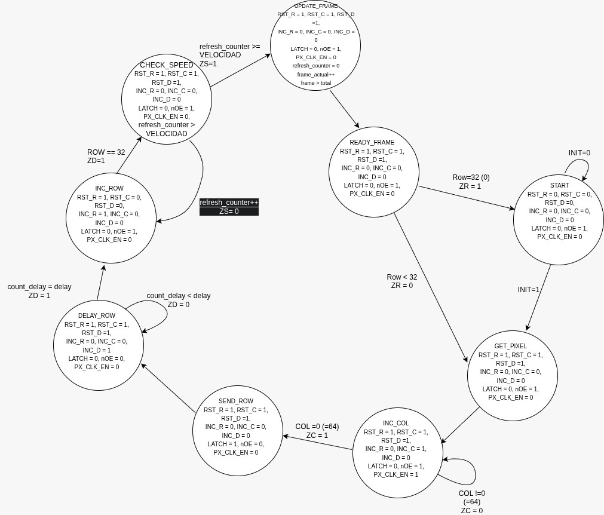

# Proyecto Final: Electrónica Digital

## Integrantes del Equipo
| Nombre Completo | Identificación (SIA) |
|-----------------|----------------------|
| Mario José Riaño Galán      | 1029660086 |
| Juan Camilo Morales Hernández     | 1104545232            |
|  Isaias David Gallardo Felizzola   | 1042247018            |

---

## Tabla de Contenido
1. [Multiplicador](#1-multiplicador)
2. [Divisor](#2-divisor)
3. [Raíz Cuadrada](#3-raíz-cuadrada)
4. [Convertidor Binario a BCD](#4-convertidor-binario-a-bcd)
5. [Calculadora](#5-calculadora)
6. [Proyecto](#6-proyeccto)
---

## 1. Multiplicador

### Especificaciones Iniciales
Descripción breve de los bits de entrada, salida y el método utilizado (ej: Algoritmo de Booth o Sumas sucesivas).

### Diseño del Sistema
#### Diagrama de Flujo (Algoritmo)

#### Diagrama de Bloques (Camino de Datos)

#### Máquina de Estados (Control)

### Implementación

* **Codigo:** [Codigo Multiplicación](01_Multiplicador/src/Multiplica/)

### Simulación
La figura muestra la simulación temporal del módulo RTL de multiplicación para la operación $247 \times 127$.Inicialización: Tras un pulso de reset (rst) y la activación de la señal de inicio (init), el módulo carga los operandos $A=247$ y $B=127$, y la máquina de estados pasa al estado de inicio (state=1).

El cálculo se realiza mediante un algoritmo de multiplicación por shift-and-add. Se observa un bucle de estados (state transiciona entre 1, 3, 2, 3) que se repite 8 veces (o el número de bits del multiplicador B). Las señales de control add (suma) y sh (desplazamiento) se activan de forma síncrona con el reloj (clk) para realizar las sumas parciales y los desplazamientos necesarios. El registro de producto parcial (pp[31:0]) refleja el resultado acumulado en cada ciclo, pasando por valores intermedios como 741, 1729, 3705, etc.

Una vez completadas las iteraciones, la máquina de estados transiciona al estado final (state=4), y la señal done se activa. El resultado final se encuentra disponible en el registro pp[31:0], mostrando el valor correcto de 31369 ($247 \times 127$).

### Pruebas en FPGA
[Ver Video de Funcionamiento en YouTube](LINK_DEL_VIDEO_AQUI)

---

## 2. Divisor

### Especificaciones Iniciales
* **Entradas:**
    * `Dividendo`: Número binario de *N* bits (ej. 8 bits).
    * `Divisor`: Número binario de *M* bits (ej. 4 bits).
    * `Start`: Señal de inicio de operación.
* **Salidas:**
    * `Cociente`: Resultado entero de la división.
    * `Residuo`: El resto de la operación.
    * `Done/Ready`: Señal que indica que la operación ha terminado.
* **Método:** (Indica aquí el algoritmo usado, ej: *Algoritmo de Restauración / Restoring Division* o *Desplazamiento y Resta*).

### Diseño del Sistema

#### Diagrama de Flujo (Algoritmo)
*Describe la lógica de pasos: Cargar registros, desplazar a la izquierda, restar divisor, verificar signo, decidir si restaurar o no.*

#### Diagrama de Bloques (Camino de Datos)
*Muestra los registros (A, Q, M), la ALU (restador) y los multiplexores.*

#### Máquina de Estados (Control)
*Diagrama de la FSM que controla los desplazamientos y las restas (Estados: IDLE, SHIFT, SUB, RESTORE, END).*

### Implementación
El código fuente está separado en unidad de control y camino de datos para modularidad.
* **Camino de Datos (Datapath):** [Ver Código](./02_Divisor/src/datapath.v)
* **Unidad de Control:** [Ver Código](./02_Divisor/src/control_unit.v)
* **Módulo Superior (Top):** [Ver Código](./02_Divisor/src/top_divisor.v)

### Simulación
La simulación temporal corresponde al módulo RTL de división, ejecutando la operación $127 \div 25$ ($Dividendo=127$, $Divisor=25$).

|Tras el pulso de rst y la activación de init, los operandos se cargan ($127$ y $25$), y la máquina de estados pasa del estado de reposo (state=0) al estado de inicio (state=1).

El algoritmo implementado es de resta y desplazamiento (shift-and-subtract), que se ejecuta en un bucle de estados iterativo. En cada ciclo de reloj, la máquina de estados gestiona si se realiza una resta (sub=1) y el desplazamiento (sh=1) del residuo y cociente parcial.Resultado: Al finalizar el proceso iterativo, la máquina de estados alcanza el estado final (state=5), y la señal done se activa. Los resultados finales se estabilizan en

:Cociente (q[15:0]): 5

Residuo (rem[15:0]): 2

   Estos resultados validan la correcta implementación del algoritmo, ya que $127 = (5 \times 25) + 2$.

---

## 3. Raíz Cuadrada

### Especificaciones Iniciales
* **Entrada:** Número binario de *N* bits (ej: 16 bits).
* **Salida:** Parte entera de la raíz (*N/2* bits) y residuo.
* **Método:** (Ej: Algoritmo non-restoring o de sustracción iterativa).

### Diseño del Sistema
#### Diagrama de Flujo (Algoritmo)

#### Diagrama de Estados 

#### Datapath

### Implementación
* **Camino de Datos:** [Ver Código](./03_Raiz_Cuadrada/src/datapath.v)
* **Unidad de Control:** [Ver Código](./03_Raiz_Cuadrada/src/control_unit.v)

### Simulación
La simulación temporal corresponde al módulo RTL de raíz cuadrada, que ejecuta el cálculo de $\sqrt{1089} = 33$.

Tras la activación de la señal init, el registro de entrada (A[15:0]) se carga con el radicando 1089, iniciando la operación. El circuito implementa un algoritmo de raíz cuadrada entera por aproximaciones sucesivas, gestionado por la máquina de estados. Este proceso es iterativo, y en cada ciclo de reloj (clk), las señales de control como w_sh (Desplazamiento) y w_ld (Carga) se activan secuencialmente para alinear los registros y actualizar el resultado parcial. 

El registro de salida (out_r[15:0]) evoluciona progresivamente a medida que el algoritmo determina cada bit de la raíz (pasando por 1, 2, 4, 8, 16, 32). Finalmente, el proceso se completa y el valor se estabiliza en 33.

---

## 4. Convertidor Binario a BCD

### Especificaciones Iniciales
* **Propósito:** Convertir el resultado binario para visualizarlo en los displays de 7 segmentos.
* **Método:** (Ej: Algoritmo Shift-Add-3 / Double Dabble).

### Diseño del Sistema
#### Diagrama de Flujo

#### Máquina de Estados
*(Si aplica, o explicar si es un diseño iterativo)*

#### DataPath

### Implementación
* **Código Fuente:** [Ver Código](./04_Binario_BCD/src/bin_to_bcd.v)

### Simulación
La simulación temporal corresponde al módulo RTL de conversión Binario a BCD (Decimal Codificado en Binario), ejecutando el cálculo para la entrada binaria 15 (0000000000001111).

El proceso se inicializa con la carga de la entrada binaria en el registro A[15:0]. El algoritmo se basa en el método iterativo Shift-and-Add-3

Que se requiere 16 ciclos de reloj para procesar los 16 bits de entrada. En cada ciclo, la señal w_sh (Desplazamiento) se activa para mover los bits hacia la izquierda. Las señales de corrección w_dec se activan solo si algún dígito BCD parcial supera el valor de 4 (lo que no ocurre frecuentemente con números tan pequeños como 15), aplicando la regla de "Sumar 3". Al completar las iteraciones, el registro de resultado (C[15:0]) se estabiliza mostrando el valor BCD de 15 (0001 0101).

---

## 5. Calculadora (Integración Final)

)

### Código Fuente (Top Module)
* **Archivo Principal:** [Top_Module.v](./06_Calculadora/src/top_calc.v)
* **Constraint File (.xdc/.ucf):** [Pines.xdc](./06_Calculadora/src/constraints.xdc)

### Demostración Final
#### Simulación de una operación completa
*Ejemplo: Ingresar 10, seleccionar multiplicación, ingresar 5, obtener 50.*

#### Video del Proyecto Final
Prueba completa en la FPGA con todas las operaciones.
[**VER VIDEO EN YOUTUBE**](LINK_AQUI)

---
## Proyecto Final
Este proyecto consiste en el diseño e implementación de un sistema digital capaz de reproducir animaciones cortas (formato GIF) en una **Matriz de LED [64x64]**. El sistema lee los cuadros de animación almacenados en memoria y los despliega secuencialmente controlando la temporización y el barrido de la matriz.

El diseño se ha realizado utilizando **[Verilog]** y se ha implementado en la tarjeta de desarrollo **[FPGA Colorligth 5A]**.

---

##  Especificaciones Técnicas
* **Hardware:** [FPGA Basys 3 / Cyclone II / Otro], Matriz LED [Modelo, ej: MAX7219].
* **Lenguaje:** [Verilog].
* **Frecuencia de Reloj:** [Ej: 50 MHz con divisor de frecuencia a 1 Hz para la animación].

---
## Diseño y Arquitectura
El sistema se divide en dos grandes bloques: la Unidad de Control (FSM) y el Camino de Datos (Datapath).

### 1. Diagrama de Flujo (Lógica General)
Este diagrama representa la lógica de alto nivel: desde el inicio del sistema, la carga de la memoria ROM/RAM, hasta el bucle de visualización de filas y columnas.

*(Aquí va tu imagen mostrando cómo el sistema decide cuándo cambiar de frame)*

### 2. Máquina de Estados (FSM)
La Unidad de Control gestiona las transiciones entre los estados de *Reset*, *Lectura de Memoria*, *Envío de Datos* y *Actualización de Display*.

> **Nota:** El sistema utiliza una máquina de estados tipo [Moore/Mealy] para sincronizar el barrido de la matriz.

### 3. Datapath (Camino de Datos)
Aquí se detallan los contadores (para las direcciones de memoria y barrido de filas), los multiplexores y los registros de desplazamiento utilizados para enviar los bits a la matriz.

---

## Código y Módulos
La estructura del proyecto es modular. Los archivos principales son:

| Archivo | Descripción |
| :--- | :--- |
| `top_level.vhd` | Módulo principal que conecta la FSM y el Datapath. |
| `clock_div.vhd` | Divisor de frecuencia para generar el refresco visual y la velocidad del GIF. |
| `rom_memory.vhd` | Contiene la información binaria de los cuadros del GIF. |
| `led_driver.vhd` | Controlador de bajo nivel para la matriz LED. |

---

## 📊 Simulación
Antes de la implementación física, se validó el comportamiento de las señales críticas (reloj, enable, address bus) mediante simulación.

*En la imagen se observa cómo al cambiar la dirección de memoria, los datos de salida se actualizan en el siguiente flanco de reloj.*

---

##  Demostración (Funcionamiento)
A continuación se muestra el resultado final del proyecto en funcionamiento.

### Video del Proyecto

*(Haz clic en la imagen para ver el video)*

### GIF de Muestra

---
