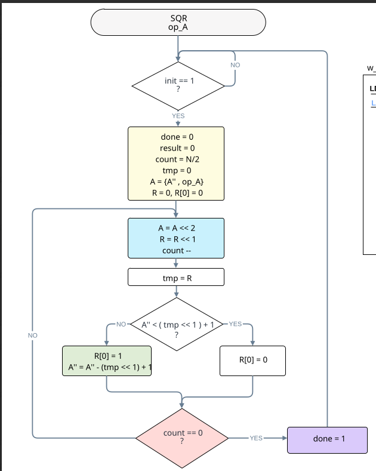

# Proyecto Final: Electrónica Digital

## Integrantes del Equipo
| Nombre Completo | Identificación (SIA) |
|-----------------|----------------------|
| Mario José Riaño Galán      | 1029660086 |
| Juan Camilo Morales Hernández     | 1104545232            |
|  Isaias David Gallardo Felizzola   | 1042247018            |

---

## Tabla de Contenido
1. [Multiplicador](#1-multiplicador)
2. [Divisor](#2-divisor)
3. [Raíz Cuadrada](#3-raíz-cuadrada)
4. [Convertidor Binario a BCD](#4-convertidor-binario-a-bcd)
5. [Calculadora](#5-calculadora)
6. [Proyecto](#6-proyeccto)
---

## 1. Multiplicador

### Especificaciones Iniciales
Descripción breve de los bits de entrada, salida y el método utilizado (ej: Algoritmo de Booth o Sumas sucesivas).

### Diseño del Sistema
#### Diagrama de Flujo (Algoritmo)

#### Diagrama de Bloques (Camino de Datos)

#### Máquina de Estados (Control)
[Flujo de Estados](01_Multiplicador/src/Multiplica/IMAGEN/DIAGRAMA%20_DE%20_ESTADOS_MUL.png)

### Implementación
* **Codigo:** [Codigo Multiplicación](01_Multiplicador/src/Multiplica/)

### Simulación
Explicación breve de qué se observa en la imagen.

### Pruebas en FPGA
[Ver Video de Funcionamiento en YouTube](LINK_DEL_VIDEO_AQUI)

---

## 2. Divisor

### Especificaciones Iniciales
* **Entradas:**
    * `Dividendo`: Número binario de *N* bits (ej. 8 bits).
    * `Divisor`: Número binario de *M* bits (ej. 4 bits).
    * `Start`: Señal de inicio de operación.
* **Salidas:**
    * `Cociente`: Resultado entero de la división.
    * `Residuo`: El resto de la operación.
    * `Done/Ready`: Señal que indica que la operación ha terminado.
* **Método:** (Indica aquí el algoritmo usado, ej: *Algoritmo de Restauración / Restoring Division* o *Desplazamiento y Resta*).

### Diseño del Sistema

#### Diagrama de Flujo (Algoritmo)
*Describe la lógica de pasos: Cargar registros, desplazar a la izquierda, restar divisor, verificar signo, decidir si restaurar o no.*

#### Diagrama de Bloques (Camino de Datos)
*Muestra los registros (A, Q, M), la ALU (restador) y los multiplexores.*

#### Máquina de Estados (Control)
*Diagrama de la FSM que controla los desplazamientos y las restas (Estados: IDLE, SHIFT, SUB, RESTORE, END).*

### Implementación
El código fuente está separado en unidad de control y camino de datos para modularidad.
* **Camino de Datos (Datapath):** [Ver Código](./02_Divisor/src/datapath.v)
* **Unidad de Control:** [Ver Código](./02_Divisor/src/control_unit.v)
* **Módulo Superior (Top):** [Ver Código](./02_Divisor/src/top_divisor.v)

### Simulación
Se realizó una simulación comportamental para verificar casos de prueba, incluyendo la división por cero (si tu circuito la maneja).
* **Caso de prueba:** Dividendo = 13 (1101), Divisor = 4 (0100) → Cociente = 3, Residuo = 1.

---

## 3. Raíz Cuadrada

### Especificaciones Iniciales
* **Entrada:** Número binario de *N* bits (ej: 16 bits).
* **Salida:** Parte entera de la raíz (*N/2* bits) y residuo.
* **Método:** (Ej: Algoritmo non-restoring o de sustracción iterativa).

### Diseño del Sistema
#### Diagrama de Flujo (Algoritmo)

#### Diagrama de Bloques (Camino de Datos)

#### Máquina de Estados (Control)

### Implementación
* **Camino de Datos:** [Ver Código](./03_Raiz_Cuadrada/src/datapath.v)
* **Unidad de Control:** [Ver Código](./03_Raiz_Cuadrada/src/control_unit.v)

### Simulación
Descripción de la prueba: *Se verifica la raíz de 144 (resultado 12) y 150 (resultado 12, residuo 6).*

### Pruebas en FPGA
[Ver Video de Funcionamiento](./assets/video_sqrt_link.md)

---

## 4. Convertidor Binario a BCD

### Especificaciones Iniciales
* **Propósito:** Convertir el resultado binario para visualizarlo en los displays de 7 segmentos.
* **Método:** (Ej: Algoritmo Shift-Add-3 / Double Dabble).

### Diseño del Sistema
#### Diagrama de Flujo

#### Diagrama de Bloques

#### Máquina de Estados
*(Si aplica, o explicar si es un diseño iterativo)*

### Implementación
* **Código Fuente:** [Ver Código](./04_Binario_BCD/src/bin_to_bcd.v)

### Simulación

---

## 5. Calculadora (Integración Final)

### Especificaciones del Sistema Completo
Descripción de la ALU (Unidad Aritmético Lógica) o el sistema central que une todos los módulos anteriores.
* **Entradas:** Teclado matricial 4x4 / Switches.
* **Salidas:** Displays de 7 segmentos / VGA.
* **Operaciones Soportadas:** Suma, Resta, Multiplicación, División, Raíz.

### Diagrama de Bloques General (Top Level)
*Este diagrama muestra cómo se conectan los submódulos (instancias) entre sí.*

### Máquina de Estados Principal
*Diagrama de la FSM que controla qué operación se realiza según la entrada del usuario.*

### Código Fuente (Top Module)
* **Archivo Principal:** [Top_Module.v](./06_Calculadora/src/top_calc.v)
* **Constraint File (.xdc/.ucf):** [Pines.xdc](./06_Calculadora/src/constraints.xdc)

### Demostración Final
#### Simulación de una operación completa
*Ejemplo: Ingresar 10, seleccionar multiplicación, ingresar 5, obtener 50.*

#### Video del Proyecto Final
Prueba completa en la FPGA con todas las operaciones.
[**VER VIDEO EN YOUTUBE**](LINK_AQUI)

---
